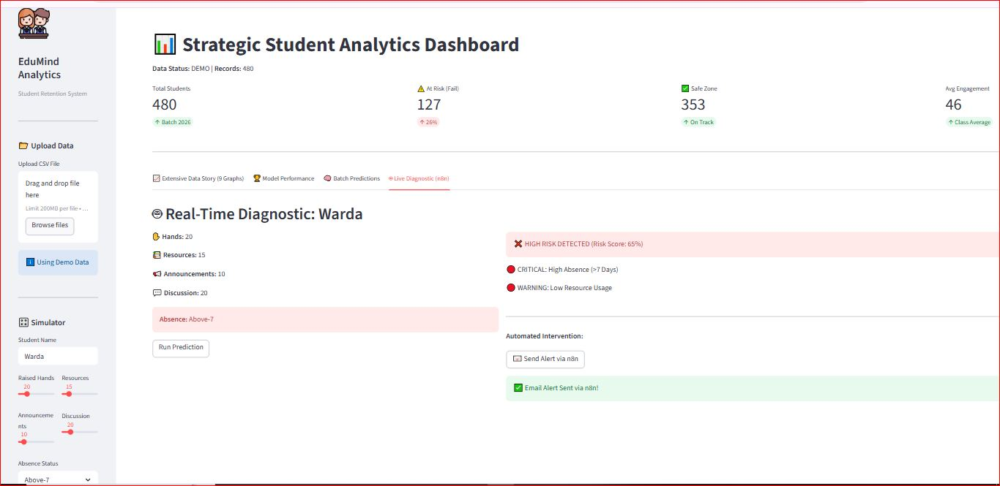
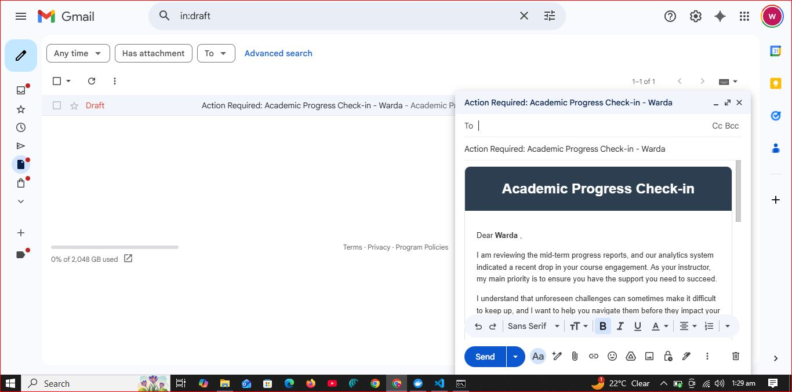
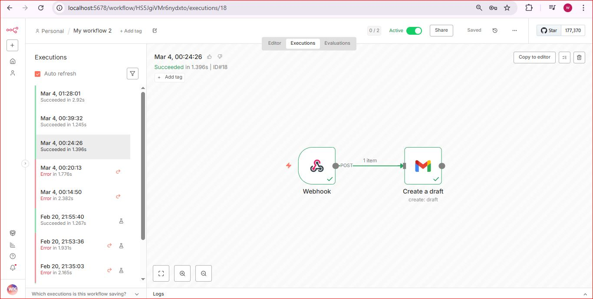

# 🎓 EduMind Analytics: AI-Powered Student Intervention System

**Predicting Risks, Enabling Success.** An intelligent early-warning system that identifies at-risk students and automates personalized interventions using AI and Low-Code Orchestration.

---

## 📺 Project Preview

### 🖥️ Interactive Dashboard

*Our Streamlit dashboard provides real-time risk probability and identified concerns.*

### 📧 Automated Instructor Draft

*AI-generated empathetic outreach draft, ready for instructor review in Gmail.*

### ⚙️ Automation Workflow (n8n)

*The low-code automation pipeline that connects AI prediction with personalized outreach.*

---

## 🚀 The Core Problem
Educational institutions often react *after* a student fails. **EduMind Analytics** shifts this to a **proactive** model by analyzing engagement data (raised hands, resource visits, discussion participation) to predict dropouts before they happen.

## ✨ Key Features
* **🧠 Machine Learning Engine**: Uses a trained model to evaluate student risk based on behavioral metrics.
* **📊 Live Risk Probability**: Instant feedback for educators on student performance status.
* **⚡ Human-in-the-Loop Automation**: Integrated with **n8n** and **Gmail API** to create ready-to-send drafts.
* **🛡️ Responsible AI**: The system doesn't send "robotic" alerts; it prepares a supportive draft for the teacher to personalize.

## 🛠️ Tech Stack
* **Language**: Python (Pandas, Scikit-Learn)
* **Frontend**: Streamlit
* **Automation**: n8n (Orchestration) & ngrok (Tunneling)
* **Integrations**: Gmail API, Webhooks

## ⚙️ How It Works (The Workflow)
1. **Data Input**: Teacher enters student metrics in the Streamlit App.
2. **AI Prediction**: The app calculates a Risk Score (e.g., 85% Risk).
3. **Webhook Trigger**: High-risk data is sent to a **local n8n instance** via an ngrok tunnel.
4. **Draft Creation**: n8n processes the data and uses the **Gmail Node** to create a formatted HTML draft in the teacher's account.

## 📂 Repository Structure
* `app.py`: Main application code.
* `model_training.py`: Model training script (Original Colab research).
* `student_model.pkl`: The "Brain" of our AI.
* `requirements.txt`: Necessary libraries for deployment.

---
**Developed with ❤️ by [Warda Khan](https://github.com/khanwarda)** *MSc Physics | AI & Data Science Practitioner | Tech Trainer*
